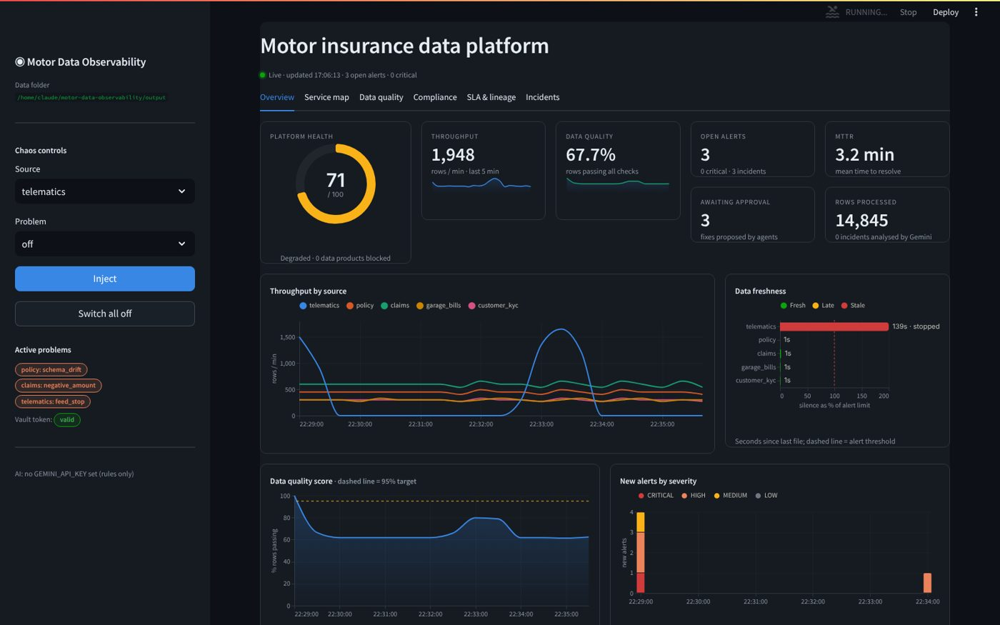
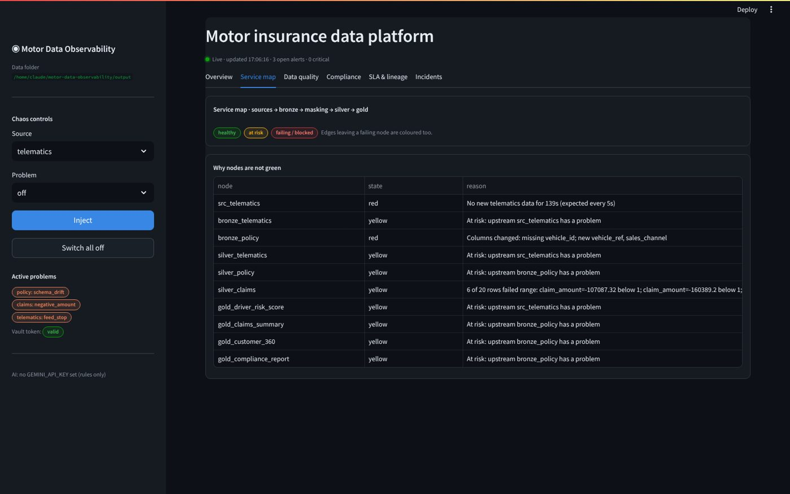
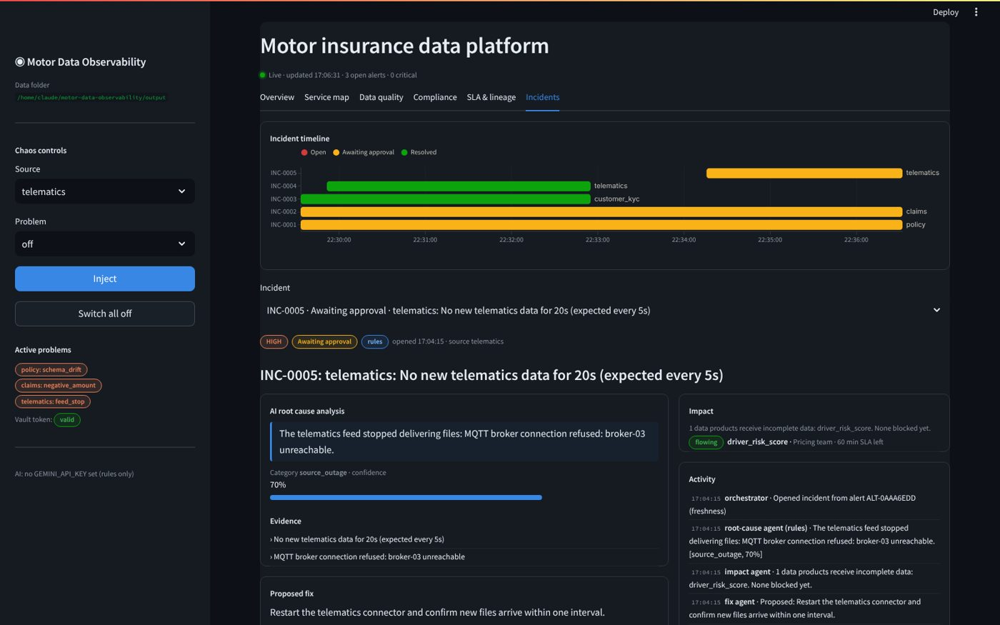

# Motor Data Observability

An AI-powered observability platform for a **motor insurance data platform**, running entirely
on a laptop. Five live data feeds flow through a Bronze → Silver → Gold pipeline. Checks run on
every batch, AI agents work out *why* something broke and *what it affects*, and a person
approves the fix before it touches real data.

```
5 live sources ──> Bronze ──> checks ──> Silver ──> Gold data products
 (generators)       (raw)        │        (clean,      (risk score, claims,
                                 │         masked)      fraud, customer 360,
                                 ▼                      compliance)
                          alerts table
                                 │
                 orchestrator ─> root cause (Gemini) ─> impact ─> fix proposal
                                                                      │
                                       person approves in dashboard ◄─┘
                                                │
                                test on sample ─> apply ─> verify ─> report
```



## Run it

Needs Python 3.10 or newer.

```bash
git clone https://github.com/ManasiKhaire/motor-data-observability.git
cd motor-data-observability
python -m venv .venv
source .venv/bin/activate            # Windows: .venv\Scripts\activate
pip install -r requirements.txt
cp .env.example .env                 # Windows: copy .env.example .env, then add your Gemini key
python check_gemini.py               # optional: tests the key, proxy and certificates
```

Open **three terminals** in the project folder (activate the venv in each):

| Terminal | Command | What it does |
|---|---|---|
| 1 | `python run_all.py` | Five sources write new files every few seconds |
| 2 | `python run_pipeline.py --reset` | Loads, checks, transforms and runs the agents every 5 s |
| 3 | `streamlit run app/dashboard.py` | Dashboard at http://localhost:8501 |

## The dashboard

| Tab | What it shows |
|---|---|
| **Overview** | Platform health score, throughput, data quality %, open alerts, MTTR; throughput by source, freshness, quality trend, alerts by severity, a source × check failure heatmap, active incidents |
| **Service map** | Live lineage graph: every step coloured by health with rows/min, failing edges highlighted |
| **Data quality** | Rows stopped by each check, pass rate per source, full alert list |
| **Compliance** | DPDP / IRDAI / PII policy status, unmasked rows, halted publishing, masked sample |
| **SLA & lineage** | SLA budget per data product, blast-radius explorer |
| **Incidents** | Incident timeline, AI root cause with confidence and evidence, impact, proposed fix with Approve / Reject, activity log, final report |

The sidebar has **chaos controls** to inject or clear problems live.

| Service map | Incident |
|---|---|
|  |  |

## Demo in five minutes

1. Open the dashboard. Everything is green, and rows are counting up.
2. In the sidebar, choose **customer_kyc → expired_token** and click **Inject**.
3. Within about 10 seconds:
   - the **Overview** health score drops and the failure heatmap lights up
   - the **Service map** turns `mask pii` red and the two customer Gold tables red (publishing halted)
   - **Compliance** shows AT RISK and unmasked rows in Silver
   - **Incidents** shows a new incident: root cause *Vault token expired*, impact, proposed fix
4. Click **Approve fix**. On the next cycle the agents test the fix on a sample, apply it,
   re-mask the leaked rows, release Gold and write the final report.
5. Try more: `policy → schema_drift` (fixed with a column mapping), `telematics → feed_stop`,
   `claims → negative_amount`, `garage_bills → late`.

You can also approve from the terminal: `python approve.py` lists waiting fixes,
`python approve.py INC-0001` approves one, `--reject` hands it to the owner.

## Does Gemini cope with live, changing data?

Yes, because Gemini never reads the stream. Python handles every batch (checks, counts,
freshness). Gemini is called only when an incident opens, with a small summary of alerts,
a few log lines and the lineage, and once more for the final report: about **two calls per
incident**. How fast the data changes does not matter, and you stay inside free-tier limits.

The LLM also never decides *what code runs*. It explains the cause; the fix is always one
action from a fixed playbook, and only after a person approves.

## Gemini behind Zscaler

| Symptom (`python check_gemini.py`) | Fix |
|---|---|
| `no GEMINI_API_KEY set` | Add `GEMINI_API_KEY=...` to `.env` (get one at aistudio.google.com/apikey) |
| `SSL certificate problem` | Zscaler inspects HTTPS. Get the Zscaler root certificate (from IT, or export "Zscaler Root CA" from your browser as .pem/.cer) and set `GEMINI_CA_BUNDLE=path\to\zscaler.pem` in `.env` |
| `network: ...` or `HTTP 403` | The API is blocked by policy. Ask IT to allow `generativelanguage.googleapis.com`, or run with `LLM_MODE=offline` |
| `HTTP 429` | Free-tier rate limit; wait a minute. Raise `min_seconds_between_calls` in `config/settings.yaml` |
| `HTTP 404` | The model was retired. The client tries the `fallback_models` in `config/settings.yaml` automatically; you can also set `GEMINI_MODEL` in `.env` |

With no key or no network, everything still works: the agents use their built-in rules,
and the dashboard says "analysed by rules".

## Problems you can inject

| Source | Problems | Caught by | Fix the agents propose |
|---|---|---|---|
| telematics | `feed_stop`, `duplicates`, `impossible_values` | freshness, duplicates, range | restart connector / quarantine and notify |
| policy | `schema_drift`, `bad_dates`, `missing_vehicle_id` | schema, rule, nulls | column mapping and reload / quarantine |
| claims | `null_amount`, `negative_amount`, `duplicate_claim`, `expired_policy` | nulls, range, duplicates, referential | quarantine and notify |
| garage_bills | `total_mismatch`, `orphan_claim`, `late` | reconciliation, referential, freshness | quarantine / restart connector |
| customer_kyc | `expired_token`, `duplicate_customer`, `invalid_pan` | PII scan, duplicates, format | renew Vault token and re-mask / quarantine |

## Project map

| Path | What it is |
|---|---|
| `generators/` | The five sources, each with its problems |
| `pipeline/runner.py` | One cycle: ingest → checks → Silver → PII scan → Gold → map colours |
| `pipeline/checks.py` | Schema, nulls, ranges, formats, duplicates, references, reconciliation, PII |
| `pipeline/transform.py` | Column mappings, PII masking (needs the Vault token), Silver writes |
| `pipeline/gold.py` | The five Gold data products, and blocking/unblocking them |
| `agents/orchestrator.py` | Moves each incident through its life, one step per cycle |
| `agents/root_cause.py` | Gathers evidence, asks Gemini (or rules) for the cause |
| `agents/impact.py` | Walks lineage downstream; SLA countdown per Gold table |
| `agents/fixer.py` + `actions.py` | The fix playbook; test on sample, apply, verify |
| `agents/reporter.py` | Final incident report (also saved to `output/reports/`) |
| `agents/llm.py` | Gemini client (standard library only; proxy and certificate aware) |
| `app/dashboard.py` | Streamlit dashboard (layout) |
| `app/charts.py`, `app/data.py` | Chart styles (dark theme, fixed colour per source) and the queries behind them |
| `schemas/source_contracts.json` | Expected columns and rules per source |
| `lineage/lineage.json` | What feeds what, owners, SLAs |
| `output/` | Generated files, logs, `observability.db`, reports (not committed) |
| `databricks/`, `sql/` | Notebooks and table DDL for running the same idea on Databricks |
| `docs/HOW_IT_WORKS.md` | The design explained step by step |

Run the tests with `python -m pytest -q` (Gemini is switched off in tests).
